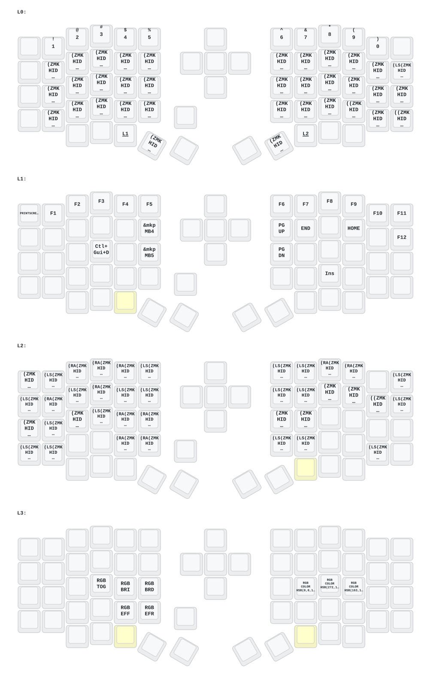

## 🧩 Descripción del firmware
Este es un *fork* del firmware **ZMK Eyelash** que suelen usar muchos vendedores de AliExpress, pero con mi propio *keymap* (distribución de teclas).

Si por alguna razón te interesa mi layout, puedes usarlo sin problema.


## 📥 Cómo descargar el firmware
1. Ve a la pestaña **“Actions”** del repositorio.
2. Descarga los archivos de firmware de la **última build disponible**.


## 🔌 Preparar el teclado para flashear
Para cada parte (lado izquierdo, derecho y dongle):

1. Conecta el dispositivo por USB.
2. Haz **doble clic en el botón trasero** de la placa.
3. Aparecerá una unidad USB (como si fuera un pendrive).


## ♻️ Resetear configuración (IMPORTANTE)
1. Copia el archivo `settings_reset` en la unidad USB.
2. Espera a que se cargue (la unidad desaparecerá).
3. Vuelve a hacer **doble clic en el botón** para entrar otra vez en modo carga.


## ⌨️ Flashear cada parte

### 🔹 Lado izquierdo
Copia este archivo:
```eyelash_sofle_peripheral_left nice_view_battery-nice_nano_v2-zmk.uf2```


### 🔹 Lado derecho
Copia este archivo:
```eyelash_sofle_peripheral_right nice_view_battery-nice_nano_v2-zmk.uf2```


### 🔹 Dongle (receptor)
Copia este archivo:
```eyelash_sofle_central_dongle_oled.uf2```

[Editor de keymap](https://nickcoutsos.github.io/keymap-editor/)

## ⚠️ Advertencia
Flasheas el dispositivo **bajo tu propia responsabilidad**.

Asegúrate de:
- Tener una copia de seguridad del firmware original  
- Confirmar que este firmware es compatible con tu teclado  


